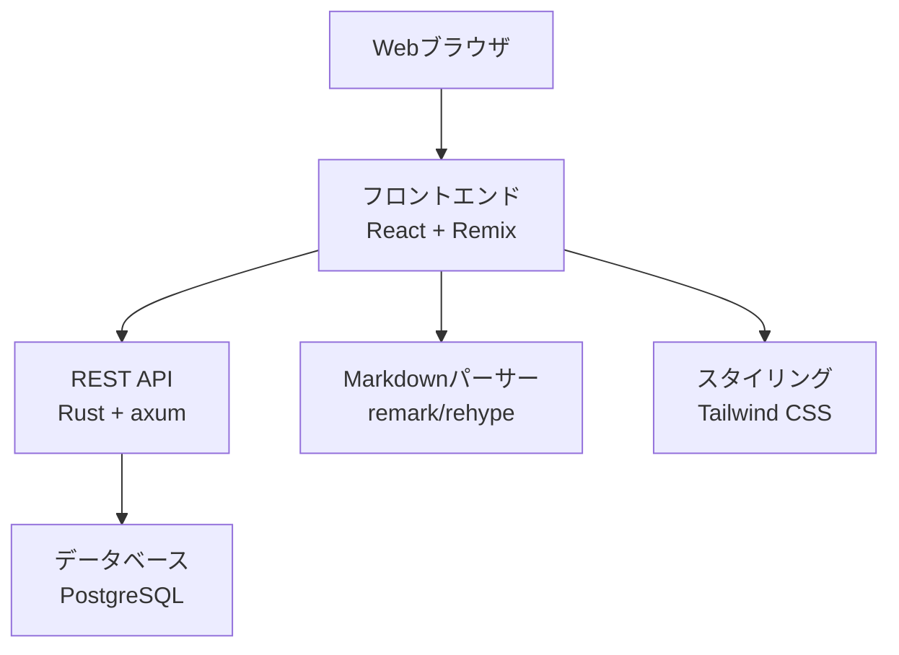

# 設計文書

## 概要

WebベースのMarkdown対応Todoアプリケーションは、モダンなフルスタックアーキテクチャで構築されます。React + Remixによるフロントエンド、Rust + axumによる高性能バックエンドAPI、PostgreSQLデータベースを組み合わせて、ユーザーがMarkdown記法でタスクを作成・管理できるアプリケーションを提供します。

## アーキテクチャ

### システム構成



### 技術スタック

- **フロントエンド**: React 18 + Remix + TypeScript
- **Markdownパーサー**: remark + rehype
- **バックエンド**: Rust + axum
- **データベース**: PostgreSQL
- **HTTP通信**: Remix loader/action
- **スタイリング**: Tailwind CSS
- **ORM**: sqlx (Rust)

## コンポーネントとインターフェース

### フロントエンドコンポーネント

#### 1. Root Component (app/root.tsx)
- **責任**: アプリケーション全体のレイアウトとメタデータ
- **機能**:
  - Tailwind CSSの読み込み
  - エラーバウンダリの設定
  - 共通レイアウトの提供

#### 2. Index Route (app/routes/_index.tsx)
- **責任**: メインのTodoアプリケーション画面
- **機能**:
  - `loader`: サーバーからタスク一覧を取得
  - `action`: フォーム送信の処理
  - TodoListとTodoFormコンポーネントの統合

#### 3. TodoList Component
- **責任**: タスク一覧の表示と基本操作
- **Props**:
  - `todos: Todo[]`: 表示するタスクリスト
  - `onToggle: (id: number) => void`: 完了状態切り替え
  - `onDelete: (id: number) => void`: タスク削除

#### 4. TodoForm Component
- **責任**: タスクの作成と編集インターフェース
- **Props**:
  - `todo?: Todo`: 編集対象のタスク（新規作成時はundefined）
  - `onSubmit: (data: TodoData) => void`: フォーム送信ハンドラー
- **機能**:
  - Markdownプレビュー機能
  - バリデーション

#### 5. MarkdownRenderer Component
- **責任**: MarkdownテキストのHTML変換と表示
- **Props**:
  - `content: string`: Markdownテキスト
  - `className?: string`: 追加のCSSクラス
- **機能**:
  - remark/rehypeによるMarkdown変換
  - XSS対策のためのサニタイゼーション

### バックエンドAPI

#### REST APIエンドポイント

```
GET    /api/todos          - タスク一覧取得
POST   /api/todos          - 新規タスク作成
GET    /api/todos/:id      - 特定タスク取得
PUT    /api/todos/:id      - タスク更新
DELETE /api/todos/:id      - タスク削除
```

#### APIレスポンス形式

```json
{
  "success": true,
  "data": {
    "id": 1,
    "title": "タスクタイトル",
    "content": "## Markdownコンテンツ\n- リスト項目",
    "completed": false,
    "createdAt": "2025-01-17T10:00:00Z",
    "updatedAt": "2025-01-17T10:00:00Z"
  },
  "error": null
}
```

## データモデル

### Todo テーブル

```sql
CREATE EXTENSION IF NOT EXISTS "uuid-ossp";

CREATE TABLE todos (
    id UUID PRIMARY KEY DEFAULT uuid_generate_v7(),
    title TEXT NOT NULL,
    content TEXT NOT NULL,
    completed BOOLEAN DEFAULT FALSE,
    created_at TIMESTAMP WITH TIME ZONE DEFAULT CURRENT_TIMESTAMP,
    updated_at TIMESTAMP WITH TIME ZONE DEFAULT CURRENT_TIMESTAMP
);
```

### フロントエンドデータ構造

```typescript
interface TodoData {
  id?: number;
  title: string;
  content: string;
  completed: boolean;
  createdAt?: Date;
  updatedAt?: Date;
}

class Todo implements TodoData {
  id?: number;
  title: string;
  content: string;
  completed: boolean;
  createdAt: Date;
  updatedAt: Date;
  
  constructor(data: Partial<TodoData>) {
    this.id = data.id;
    this.title = data.title || '';
    this.content = data.content || '';
    this.completed = data.completed || false;
    this.createdAt = data.createdAt || new Date();
    this.updatedAt = data.updatedAt || new Date();
  }
  
  validate(): boolean {
    return this.title.trim().length > 0;
  }
  
  toJSON(): Omit<TodoData, 'createdAt' | 'updatedAt'> {
    return {
      id: this.id,
      title: this.title,
      content: this.content,
      completed: this.completed
    };
  }
}
```

## エラーハンドリング

### フロントエンドエラー処理

1. **ネットワークエラー**: オフライン状態の検出とローカルストレージへのフォールバック
2. **バリデーションエラー**: フォーム入力の検証とユーザーフィードバック
3. **APIエラー**: サーバーエラーレスポンスの適切な表示

```typescript
type MessageType = 'info' | 'warning' | 'error' | 'success';

interface ApiError extends Error {
  name: string;
  message: string;
  status?: number;
}

class ErrorHandler {
    static handleApiError(error: ApiError): void {
        if (error.name === 'NetworkError') {
            this.showMessage('オフラインモードで動作しています', 'warning');
        } else {
            this.showMessage('エラーが発生しました: ' + error.message, 'error');
        }
    }
    
    static showMessage(message: string, type: MessageType): void {
        // ユーザーへの通知表示
    }
}
```

### バックエンドエラー処理

1. **データベースエラー**: 接続エラーとクエリエラーの処理
2. **バリデーションエラー**: 入力データの検証
3. **HTTPエラー**: 適切なステータスコードとエラーメッセージの返却

```rust
#[derive(Debug, thiserror::Error)]
enum AppError {
    #[error("バリデーションエラー: {0}")]
    Validation(String),
    
    #[error("データベースエラー: {0}")]
    Database(#[from] sqlx::Error),
    
    #[error("内部サーバーエラー: {0}")]
    Internal(String),
}

impl axum::response::IntoResponse for AppError {
    fn into_response(self) -> axum::response::Response {
        let (status, error_message) = match &self {
            AppError::Validation(_) => (StatusCode::BAD_REQUEST, self.to_string()),
            AppError::Database(_) => (StatusCode::INTERNAL_SERVER_ERROR, "データベースエラーが発生しました".to_string()),
            AppError::Internal(_) => (StatusCode::INTERNAL_SERVER_ERROR, "サーバーエラーが発生しました".to_string()),
        };
        
        let body = Json(json!({
            "success": false,
            "error": error_message,
            "data": null
        }));
        
        (status, body).into_response()
    }
}
```

## テスト戦略

### フロントエンドテスト

1. **ユニットテスト**: 各コンポーネントの個別機能テスト
   - Todo クラスのメソッドテスト
   - MarkdownRenderer の変換テスト
   - バリデーション機能のテスト

2. **統合テスト**: コンポーネント間の連携テスト
   - フォーム送信からリスト更新までの流れ
   - API通信のモックテスト

3. **E2Eテスト**: ユーザーシナリオの自動テスト
   - タスク作成から削除までの一連の操作
   - Markdown表示の確認

### バックエンドテスト

1. **APIテスト**: 各エンドポイントの動作確認
   - CRUD操作の正常系・異常系テスト
   - レスポンス形式の検証

2. **データベーステスト**: データ永続化の確認
   - データの作成・更新・削除の検証
   - データ整合性の確認

### テストツール

- **フロントエンド**: Jest + Testing Library
- **バックエンド**: Rust標準テストフレームワーク + tokio-test
- **E2E**: Playwright または Cypress

## セキュリティ考慮事項

1. **XSS対策**: Markdownコンテンツの無害化処理
2. **入力検証**: フロントエンドとバックエンド両方での検証
3. **SQLインジェクション対策**: パラメータ化クエリの使用
4. **CORS設定**: 適切なオリジン制限

## パフォーマンス最適化

1. **フロントエンド最適化**:
   - 仮想DOM不使用による軽量化
   - 必要時のみのDOM更新
   - Markdownパーサーの遅延読み込み

2. **バックエンド最適化**:
   - データベースインデックスの適用
   - レスポンスの圧縮
   - 適切なHTTPキャッシュヘッダー

## 開発・デプロイメント環境

### Docker構成

開発環境と本番環境の両方でDockerを使用して一貫した環境を提供します。

1. **開発環境**:
   - Docker Compose による複数コンテナの管理
   - ホットリロード対応の開発サーバー
   - ボリュームマウントによるコード変更の即時反映

2. **本番環境**:
   - 最適化されたマルチステージビルド
   - 軽量なベースイメージの使用
   - 環境変数による設定管理

3. **コンテナ構成**:
   - フロントエンドコンテナ (Node.js)
   - バックエンドコンテナ (Rust)
   - データベースコンテナ (PostgreSQL)
   - リバースプロキシ (Nginx)

### CI/CD パイプライン

GitHub Actionsを使用して継続的インテグレーション/継続的デリバリーを実装します。

1. **CI ワークフロー**:
   - プルリクエスト時の自動テスト実行
   - コードの静的解析とリンター実行
   - TypeScriptとRustのコンパイルチェック
   - テストカバレッジレポート生成

2. **CD ワークフロー**:
   - メインブランチへのマージ時に自動デプロイ
   - Docker イメージのビルドと最適化
   - コンテナレジストリへのプッシュ
   - 本番環境への自動デプロイ

3. **環境分離**:
   - 開発、ステージング、本番環境の分離
   - 環境ごとの設定管理
   - デプロイ前の自動テスト