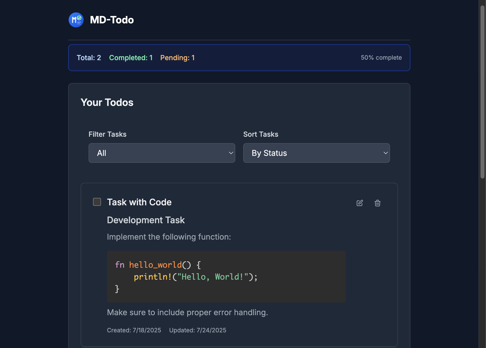

<div align="center">
  
  
  # MD-Todo
  
  A modern web-based todo application that allows users to create, manage, and organize tasks using Markdown formatting. Experience the power of rich text formatting in your task management workflow.
</div>



## Features

- **Markdown Support**: Write tasks using full Markdown syntax with real-time preview
- **Task Management**: Create, edit, update, and delete tasks with intuitive interface
- **Completion Tracking**: Mark tasks as complete/incomplete with visual indicators
- **Syntax Highlighting**: Code blocks are automatically highlighted for better readability
- **Responsive Design**: Works seamlessly on desktop and mobile devices
- **Real-time Updates**: Live preview of Markdown content as you type

## Architecture

This application follows a modern full-stack architecture:

- **Frontend**: React + Remix with TypeScript
- **Backend**: Rust + axum web framework with OpenAPI documentation
- **Database**: PostgreSQL with UUID v7 primary keys
- **API Documentation**: OpenAPI 3.0.3 with Swagger UI
- **Infrastructure**: Docker containerization for development and deployment

## Project Structure

```
md-todo/
├── frontend/                 # React + Remix frontend application
│   ├── app/                 # Remix application routes and components
│   ├── public/              # Static assets
│   ├── package.json         # Node.js dependencies
│   └── Dockerfile          # Frontend container configuration
├── backend/                 # Rust + axum backend API
│   ├── src/                # Rust source code
│   │   ├── main.rs         # Application entry point
│   │   ├── lib.rs          # Core application logic
│   │   └── bin/            # Development tools
│   │       └── generate_openapi.rs  # OpenAPI spec generator
│   ├── openapi.json        # Generated OpenAPI specification
│   ├── Cargo.toml          # Rust dependencies
│   └── Dockerfile          # Backend container configuration
├── database/               # Database configuration and migrations
│   ├── migrations/         # Database migration files
│   └── init.sql           # Database initialization script
├── .github/workflows/      # GitHub Actions CI/CD configuration
├── docker-compose.yml      # Multi-container orchestration
└── README.md              # This file
```

## Getting Started

### Prerequisites

- Docker and Docker Compose
- Node.js 18+ (for local development)
- Rust 1.70+ (for local development)

### Quick Start with Docker

1. **Clone the repository**

   ```bash
   git clone https://github.com/saitotm/md-todo.git
   cd md-todo
   ```

2. **Start the application**

   ```bash
   docker-compose up -d
   ```

3. **Access the application**
   - Frontend: http://localhost:3000
   - Backend API: http://localhost:8000
   - Database: PostgreSQL on port 5432

### Development Setup

#### Option 1: DevContainer (Recommended for VS Code)

The easiest way to get started is using the devcontainer, which provides a complete development environment:

1. **Prerequisites**

   - VS Code with Dev Containers extension
   - Docker Desktop

2. **Setup (5 minutes)**

   ```bash
   git clone https://github.com/saitotm/md-todo.git
   cd md-todo
   code .
   ```

3. **Open in DevContainer**

   - VS Code will prompt "Reopen in Container"
   - Or use Command Palette: `Dev Containers: Reopen in Container`

4. **Start Development**
   ```bash
   # Start all services
   docker compose up -d
   ```

The devcontainer includes:

- Node.js 20 + npm
- Rust toolchain (cargo, rustc, clippy, rustfmt)
- Docker CLI for container management
- VS Code extensions (ESLint, Prettier, Rust Analyzer)
- All development tools pre-configured

#### Option 2: Local Development

#### Frontend Development

```bash
cd frontend
npm install
npm run dev
```

#### Backend Development

```bash
cd backend
cargo run

# Generate OpenAPI documentation
cargo run --bin generate_openapi
```

#### Database Setup

The database is automatically initialized with sample data when using Docker Compose.

## API Documentation

### Interactive Documentation (Recommended)

Once the backend server is running, visit:

```
http://localhost:8000/swagger-ui
```

### OpenAPI Specification

- **JSON Format**: `http://localhost:8000/api-docs/openapi.json`
- **Local File**: Run `cargo run --bin generate_openapi` to generate `openapi.json`

### API Endpoints

#### Health Check

- `GET /health` - Server health status

#### Todos

- `GET /api/todos` - Get all todos
- `POST /api/todos` - Create a new todo
- `GET /api/todos/:id` - Get a specific todo
- `PATCH /api/todos/:id` - Update a todo (partial update)
- `DELETE /api/todos/:id` - Delete a todo

### Request/Response Format

#### Create Todo

```json
{
  "title": "Task Title",
  "content": "# Task Description\n\nThis is a **markdown** formatted task."
}
```

#### Todo Response

```json
{
  "success": true,
  "data": {
    "id": "018c2e65-4b7f-7000-8000-000000000000",
    "title": "Task Title",
    "content": "# Task Description\n\nThis is a **markdown** formatted task.",
    "completed": false,
    "created_at": "2024-01-01T00:00:00Z",
    "updated_at": "2024-01-01T00:00:00Z"
  }
}
```

## Testing

### Frontend Testing

```bash
cd frontend
npm test
```

### Backend Testing

```bash
cd backend
cargo test
```

### CI/CD

The project includes GitHub Actions workflows for:

- Automated testing (frontend and backend)
- Code quality checks (ESLint, Clippy)
- Format validation
- Docker build verification

## Docker Configuration

### Services

- **frontend**: React + Remix application (port 3000)
- **backend**: Rust + axum API server (port 8000)
- **db**: PostgreSQL database (port 5432)

### Volumes

- `postgres_data`: Database persistence
- `cargo_cache`: Rust dependencies cache
- `target_cache`: Rust build cache

### Environment Variables

See `.env.example` for required environment variables.

## Database Schema

### todos table

- `id`: UUID (Primary Key, generated using uuidv7())
- `title`: TEXT - Task title
- `content`: TEXT - Task content in Markdown format
- `completed`: BOOLEAN - Task completion status
- `created_at`: TIMESTAMP WITH TIME ZONE
- `updated_at`: TIMESTAMP WITH TIME ZONE
