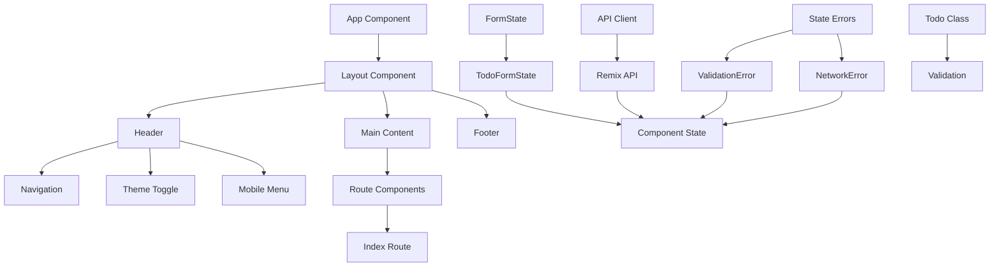

# Frontend Component Documentation

This document provides comprehensive documentation for the MD-Todo frontend application components, built with React, Remix, and TypeScript.

## Application Architecture

The MD-Todo frontend follows a modern React application architecture using Remix as the meta-framework, with a clear separation of concerns between components, state management, and API integration.

### Core Architecture Layers

1. **Presentation Layer**: React components (App, Layout, Routes)
2. **State Management Layer**: Custom FormState classes and error handling
3. **Data Layer**: API clients and Remix loaders/actions
4. **Business Logic Layer**: Todo class and validation utilities

## Component Hierarchy

The application follows this component hierarchy structure: App -> Layout -> Routes

```
App Component (root.tsx)
├── Layout Component (components/Layout.tsx)
│   ├── Header
│   │   ├── Logo and Title
│   │   ├── Desktop Navigation
│   │   ├── Theme Toggle Button
│   │   └── Mobile Menu Button
│   ├── Main Content Area
│   │   └── Route Components (Outlet)
│   └── Footer
└── Route Components
    └── Index Route Component (routes/_index.tsx)
```

### Data Flow Pattern

```
User Input → FormState → Validation → API Client → Backend API
                                         ↓
Component State ← State Update ← API Response
```

## Component Relationships



## Core Components

### App Component (root.tsx) - Root Component

The root application component that provides the basic HTML structure and integrates the Layout component.

**Purpose**: 
- Provides HTML document structure
- Loads fonts and global styles
- Wraps the application in Layout component
- Enables dark mode support via CSS classes

**Key Features**:
- Font loading (Inter font family)
- Dark mode CSS class management
- Remix meta framework integration
- Accessibility support

### Layout Component (components/Layout.tsx)

The main layout component that provides the application's visual structure and common functionality.

**Purpose**:
- Provides consistent layout across all pages
- Manages theme (dark/light mode) state
- Handles responsive design
- Implements navigation structure

**Key Features**:
- Responsive header with navigation
- Mobile-friendly menu system
- Theme toggle functionality
- Accessibility-compliant structure
- Sticky header design
- Grid-based layout system

### Index Route Component (routes/_index.tsx)

The default landing page component that displays welcome content and navigation links.

**Purpose**:
- Serves as the application's entry point
- Provides welcome message and branding
- Displays helpful navigation links
- Demonstrates responsive design

## Component Props and Events

### Layout Component

#### LayoutProps Interface

```typescript
interface LayoutProps {
  children: ReactNode;
}
```

**Props:**
- `children: ReactNode` - The child components to render within the layout

**State:**
- `isDarkMode: boolean` - Current theme state
- `isMobileMenuOpen: boolean` - Mobile menu visibility state

**Events:**
- `onClick: () => void` - Theme toggle button click handler
- `onToggle: () => void` - Mobile menu toggle handler

#### Internal Methods

```typescript
const toggleTheme = () => void;
const toggleMobileMenu = () => void;
```

### App Component

#### App Component Structure

```typescript
function Layout({ children }: { children: React.ReactNode }): JSX.Element;
function App(): JSX.Element;
```

**Props:**
- `children: React.ReactNode` - Child components for the Layout wrapper

### Index Route Component

#### MetaFunction

```typescript
export const meta: MetaFunction = () => MetaDescriptor[];
```

**Returns:**
- Array of meta descriptors for SEO and page metadata

## State Management

The MD-Todo application uses a custom state management system built around several core classes and patterns.

### FormState System

#### FormState Class

The base class for managing form state, validation, and submission.

```typescript
class FormState<T extends Record<string, unknown> = Record<string, unknown>> {
  values: T;
  errors: Record<string, string | null>;
  touched: Record<string, boolean>;
  isSubmitting: boolean;
  isDirty: boolean;
  isValid: boolean;
}
```

**Key Methods:**
- `setValue(field: keyof T, value: unknown): void` - Update individual field
- `setValues(values: Partial<T>): void` - Update multiple fields
- `validate(): boolean` - Run validation and update errors
- `reset(newValues?: T): void` - Reset form to initial state
- `submit(handler: (values: T) => Promise<unknown>): Promise<Result>` - Handle async submission
- `getFieldProps(field: keyof T): FieldProps` - Get field props for input binding

#### TodoFormState Class

Specialized form state for Todo management, extending the base FormState.

```typescript
class TodoFormState extends FormState<{
  title: string;
  content: string;
}> {
  toCreateData(): TodoCreateData;
  toUpdateData(): TodoUpdateData;
  loadFromTodo(todo: Todo): void;
}
```

**Validation Rules:**
- Title: Required, max 255 characters
- Content: Optional, max 10000 characters

### Error Handling System

#### StateError Classes

The application uses a hierarchical error handling system:

```typescript
class StateError extends Error {
  type: string;
  field?: string;
  code?: string;
  
  isValidationError(): boolean;
  isNetworkError(): boolean;
  toJSON(): Record<string, unknown>;
}

class ValidationError extends StateError {
  field: string;
  rule?: string;
  
  static required(field: string): ValidationError;
  static minLength(field: string, min: number): ValidationError;
  static maxLength(field: string, max: number): ValidationError;
  static pattern(field: string, patternName: string): ValidationError;
}

class NetworkError extends StateError {
  status?: number;
  url?: string;
  method?: string;
  
  static timeout(): NetworkError;
  static connectionFailed(): NetworkError;
  static serverError(status: number): NetworkError;
  static notFound(url?: string): NetworkError;
  
  isRetryable(): boolean;
}
```

#### ErrorHandler Utility

Centralized error handling and formatting:

```typescript
class ErrorHandler {
  static handleError(error: Error): FormattedError;
  static formatErrorsForForm(errors: Error[]): Record<string, string>;
  static shouldShowToUser(error: Error): boolean;
  static getRetryDelay(error: Error, attempt: number): number;
}
```

### Todo Class

Domain model class for Todo entities with validation and serialization:

```typescript
class Todo {
  id?: string;
  title: string;
  content: string;
  completed: boolean;
  createdAt: Date;
  updatedAt: Date;
  
  validate(): boolean;
  getValidationErrors(): string[];
  toJSON(): TodoJSON;
  toCreateData(): TodoCreateData;
  toUpdateData(fields?: string[]): TodoUpdateData;
  clone(): Todo;
  equals(other: Todo): boolean;
}
```

## API Integration

### API Client Layer (api-client.ts)

Low-level HTTP client for backend communication:

```typescript
class ApiError extends Error {
  constructor(message: string, public status?: number);
}

// Core API functions
async function getTodos(): Promise<Todo[]>;
async function createTodo(data: TodoCreateData): Promise<Todo>;
async function updateTodo(id: string, data: TodoUpdateData): Promise<Todo>;
async function deleteTodo(id: string): Promise<void>;
```

**Features:**
- Automatic error handling and retry logic
- JSON request/response handling
- Environment-based API URL configuration
- Comprehensive error classification

### Remix API Layer (remix-api.ts)

Remix-specific loaders and actions that bridge the API client with Remix's data handling:

```typescript
// Loader functions
async function getTodosLoader(): Promise<LoaderResult>;

// Action functions  
async function createTodoAction({ request }: ActionFunctionArgs): Promise<ActionResult>;
async function updateTodoAction({ request, params }: ActionFunctionArgs): Promise<ActionResult>;
async function deleteTodoAction({ params }: ActionFunctionArgs): Promise<ActionResult>;
```

**Features:**
- Server-side validation
- Form data processing
- Error response formatting
- Integration with Remix's data loading patterns

### Type System

Comprehensive TypeScript interfaces for type safety:

```typescript
interface Todo {
  id: string;
  title: string;
  content: string;
  completed: boolean;
  created_at: string;
  updated_at: string;
}

interface TodoCreateData {
  title: string;
  content: string;
}

interface TodoUpdateData {
  title?: string;
  content?: string;
  completed?: boolean;
}

interface ApiResponse<T> {
  success: boolean;
  data: T;
  error: string | null;
}

interface ValidationResult {
  isValid: boolean;
  errors: string[];
}
```

**Validation Functions:**
- `validateTodo(todo: unknown): ValidationResult`
- `validateCreateData(data: unknown): ValidationResult`
- `validateUpdateData(data: unknown): ValidationResult`

## Usage Examples

### Using FormState for Todo Forms

```tsx
import { TodoFormState } from '../lib/form-state';

function TodoForm() {
  const formState = new TodoFormState();
  // Also can create base FormState
  const baseFormState = new FormState();
  
  const handleSubmit = async () => {
    const result = await formState.submit(async (values) => {
      return await createTodo(formState.toCreateData());
    });
    
    if (result.success) {
      console.log('Todo created successfully!');
    } else {
      console.error('Failed to create todo:', result.error);
    }
  };

  return (
    <form onSubmit={handleSubmit}>
      <input
        {...formState.getFieldProps('title')}
        placeholder="Enter todo title"
      />
      <textarea
        {...formState.getFieldProps('content')}
        placeholder="Enter todo content (Markdown supported)"
      />
      <button 
        type="submit" 
        disabled={formState.isSubmitting || !formState.isValid}
      >
        {formState.isSubmitting ? 'Creating...' : 'Create Todo'}
      </button>
    </form>
  );
}
```

### Using Todo Class

```typescript
import { Todo } from '../lib/todo-class';

// Create new Todo
const todo = new Todo({
  title: 'Learn React',
  content: '# React Learning Plan\n\n- Components\n- Hooks\n- State Management',
  completed: false
});

// Validate Todo
if (todo.validate()) {
  const createData = todo.toCreateData();
  await createTodo(createData);
} else {
  const errors = todo.getValidationErrors();
  console.log('Validation errors:', errors);
}

// Update Todo
const updatedTodo = todo.clone();
updatedTodo.completed = true;
const updateData = updatedTodo.toUpdateData(['completed']);
await updateTodo(todo.id, updateData);
```

### Error Handling Example

```typescript
import { ErrorHandler, ValidationError, NetworkError } from '../lib/state-errors';

try {
  await createTodo(invalidData);
} catch (error) {
  const handled = ErrorHandler.handleError(error);
  
  if (handled.type === 'validation') {
    // Show validation errors in form
    setFormErrors(handled.field, handled.message);
  } else if (handled.type === 'network' && handled.retryable) {
    // Show retry option for network errors
    const delay = ErrorHandler.getRetryDelay(error, attemptCount);
    setTimeout(() => retryOperation(), delay);
  } else {
    // Show general error message
    showNotification(handled.displayMessage);
  }
}
```

### API Client Usage

```typescript
import { getTodos, createTodo, updateTodo, deleteTodo, ApiError } from '../lib/api-client';

// Fetch all todos
try {
  const todos = await getTodos();
  console.log('Loaded todos:', todos);
} catch (error) {
  if (error instanceof ApiError) {
    console.error('API Error:', error.message, 'Status:', error.status);
  }
}

// Create todo
const newTodo = await createTodo({
  title: 'New Task',
  content: 'Task description in **Markdown**'
});

// Update todo
const updatedTodo = await updateTodo(newTodo.id, {
  completed: true
});

// Delete todo
await deleteTodo(newTodo.id);
```

## Architecture Patterns

### Component Design Patterns

1. **Container/Presentational Pattern**: Components are designed to be either data containers (handling state/effects) or presentational (pure rendering)

2. **Composition over Inheritance**: Components use composition and props for customization rather than class inheritance

3. **Single Responsibility**: Each component has a clear, focused purpose

4. **Props Interface Design**: All component props are explicitly typed with TypeScript interfaces

### State Management Patterns

1. **Centralized Form State**: All form logic is centralized in FormState classes

2. **Immutable Updates**: State updates always create new objects rather than mutating existing ones

3. **Validation Separation**: Validation logic is separated from UI logic

4. **Error Boundaries**: Errors are caught and handled at appropriate levels

### Data Flow Patterns

1. **Unidirectional Data Flow**: Data flows down through props, events bubble up

2. **API Abstraction**: API calls are abstracted behind service layer functions

3. **Loading States**: All async operations have proper loading and error states

4. **Optimistic Updates**: UI updates immediately with rollback on error

## Development Guidelines

### Component Development

- Always provide TypeScript interfaces for props
- Include proper accessibility attributes
- Implement responsive design from mobile-first
- Use semantic HTML elements
- Handle loading and error states appropriately

### State Management

- Use FormState classes for all form-related state
- Implement proper validation before API calls
- Handle all error cases with appropriate user feedback
- Keep state as local as possible while maintaining data consistency

### Testing Considerations

- Components should be easily testable in isolation
- State management classes include comprehensive validation
- API clients include proper error handling for testing scenarios
- All async operations are properly awaitable for testing

This documentation covers the complete frontend component architecture and provides practical examples for development and maintenance of the MD-Todo application.